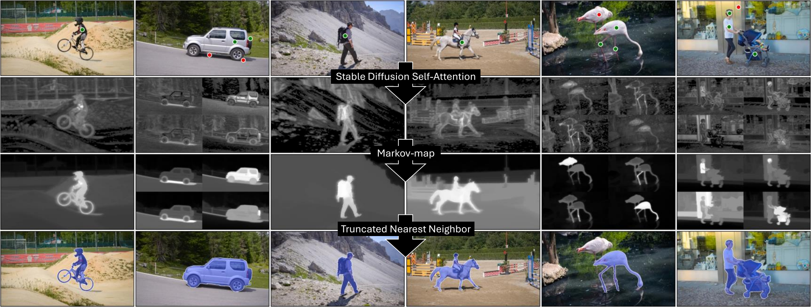

# M2N2: Markov-Map Nearest Neighbor
Official implementation of "**Repurposing Stable Diffusion Attention for Training-Free Unsupervised Interactive Segmentation**", accepted at CVPR 2025.




## 🚀 Installation
### Clone the Repository
```bash
git clone <anonymized>
cd m2n2
```
### Create and Activate Conda Environment
```bash
conda create -n m2n2 python=3.9
conda activate m2n2
pip install -r requirements.txt
```

## 🛠️ Usage
### M2N2 Segmentation Model
We provide an example on how to use the M2N2 segmentation model in `m2n2_example.py` given a list of prompt points and an example image of the GrabCut dataset:
```python
# Inputs
image_rgb = cv2.imread('./images/image.jpg')[:, :, ::-1]
points = [(300, 175), (135, 140), (200, 150), (200, 286)]
points_in_segment = [True, True, True, False]

# Predict
attn_aggregator = StableDiffusion2AttentionAggregator(device='cuda:0')
model = M2N2SegmentationModel(attn_aggregator)
segmentation = model.segment(
    img=image_rgb,
    points=points,
    points_in_segment=points_in_segment
)
```
### Interactive Demo
We also provide a small interactive segmentation demo in which the user can place prompt points with the following controls:
* Key I: Add new foreground point at cursor position
* Key O: Add new background point at cursor position
* Key R: Reset all points
* Key ESC: Close Demo
```shell
python m2n2_interactive_demo.py ./images/image.jpg
```


### Creating Markov-maps
Markov-maps enhance the semantic information in attention maps.
We provide an example script for generating them for a given image and point in `markov_map_example.py`:
```python
# Inputs
image_rgb = cv2.imread('images/image.jpg')[:, :, ::-1]
point = (300, 175)

# Get attention tensor
attn_aggregator = StableDiffusion2AttentionAggregator(device='cuda:0')
attention_tensor = attn_aggregator.extract_attention(image_rgb)

# Generate Markov-map
A = adjust_temperature_and_ipf(attention_tensor)
markov_map = create_markov_map_from_point(
    image=image_rgb,            # RGB input image as numpy array of shape (Height, Width, 3)
    A_tensor=A,                 # Attention tensor of shape (R, R, R, R)
    point=point,                # 2D point in image pixel coordinates: (x, y)
)
```

## 📊 Evaluation
### Download and Prepare the Datasets
We provide a script to automatically download and convert our four evaluation datasets (GrabCut, Berkeley, DAVIS, and SBD) into the [COCO Data format](https://cocodataset.org/#format-data), following the [f-BRS repository](https://github.com/SamsungLabs/fbrs_interactive_segmentation).
```shell
python prepare_datasets.py --grabcut --berkeley --sbd --davis
```
Datasets will be stored in:
* `./datasets/raw` Original format
* `./datasets/coco` Converted to COCO format

Additionally, we also consider the BraTS20 (--brats) and OAI-ZIB (--oaizib) datasets available in the [SimpleClick Repository](https://github.com/uncbiag/SimpleClick).
(The OAI-ZIB dataset can not be downloaded automatically and therefore has to be downloaded and extracted into `./datasets/raw/OAI-ZIB` manually before calling `prepare_datasets.py --oaizib`)

### Run Evaluation
```shell
python evaluate_datasets.py --grabcut --berkeley --sbd --davis
```
Detailed per-instance evaluation metrics will be stored in `./out/<dataset_name>_metrics.json`.

### Results
*Due to further code optimizations, the results might differ slightly from to the results reported in the paper*.

| Version    | Grabcut<br/>NoC85 | Grabcut<br/>NoC90 | Berkeley<br/>NoC85 | Berkeley<br/>NoC90 | SBD<br/>NoC85 | SBD<br/>NoC90 | DAVIS<br/>NoC85 | DAVIS<br/>NoC90 |
|------------|-------------------|-------------------|--------------------|--------------------|---------------|---------------|-----------------|-----------------|
| Paper      | 1.62              | 1.90              | 2.45               | 3.88               | 7.72          | 10.94         | 4.60            | 6.72            |
| Repository | 1.62              | 1.90              | 2.45               | 3.87               | 7.71          | 10.95         | 4.58            | 6.74            |


## 🖊️ Citation
If you find this work helpful, please consider citing our paper.
```bibtex
@misc{karmann2024repurposingstablediffusionattention,
      title={Repurposing Stable Diffusion Attention for Training-Free Unsupervised Interactive Segmentation}, 
      author={Markus Karmann and Onay Urfalioglu},
      year={2024},
      eprint={2411.10411},
      archivePrefix={arXiv},
      primaryClass={cs.CV},
      url={https://arxiv.org/abs/2411.10411}, 
}
```
